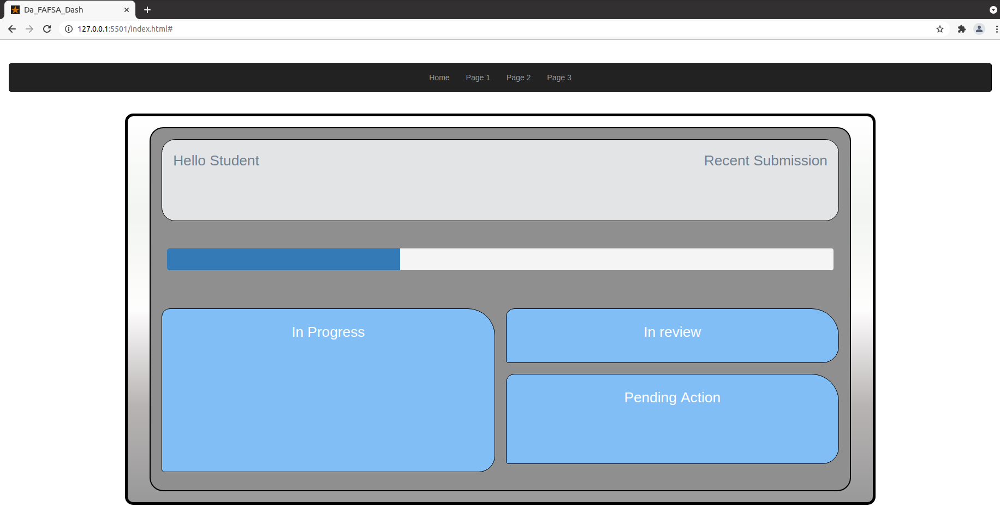

# Call_to_Action 

## The Problem
* Filling out the Free Application for Federal Student Aid (FAFSA) is complicated. 
* Students from low-income families, first-generation college students, and first-generation immigrant students face unique challenges in completing the FAFSA. 
* Each year, hundreds of thousands of students living in poverty do not complete the FAFSA, leading to billions of dollars in unclaimed Pell Grants (federal student aid for low-income students). Without this aid, these students are often unable to afford college tuition. 
## The Opportunity
* How might we use our knowledge of web development to ensure more students successfully and accurately complete the FAFSA? 
## The Solution
* Building a web application that addresses this problem space. 
* Being creative and with no specific requirements for features to address this problem space.  
* Demonstrating what has been learned up to this point. We are also free to incorporate other technologies and platforms that we have not yet uncovered....

## Screen Shots  
  

 
## Installation

Steps necessary to get the application up and running will be forth coming.

## Usage 

Usage will be determined as project is updated.

## Project collaborators 

Thank you to the Wyncode Cohorts who contributed to this project:

Link to github: https://github.com/asath1

## Project status

This project is still being develped and has the potential for unlimited features and functionality.

## Roadmap

How would you like to see this project grow in the future? Please leave a comment and share any suggestions.
